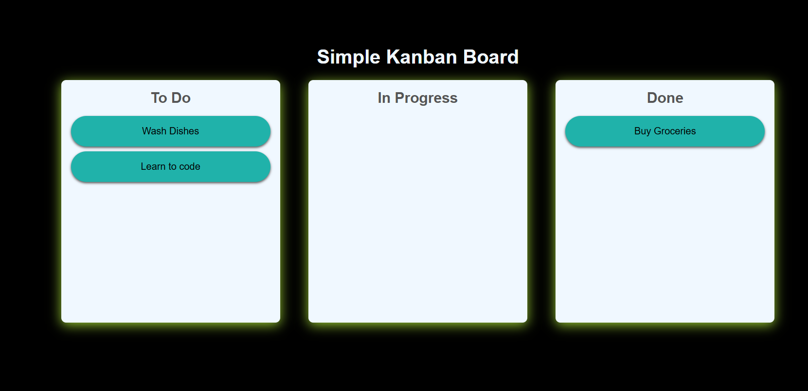
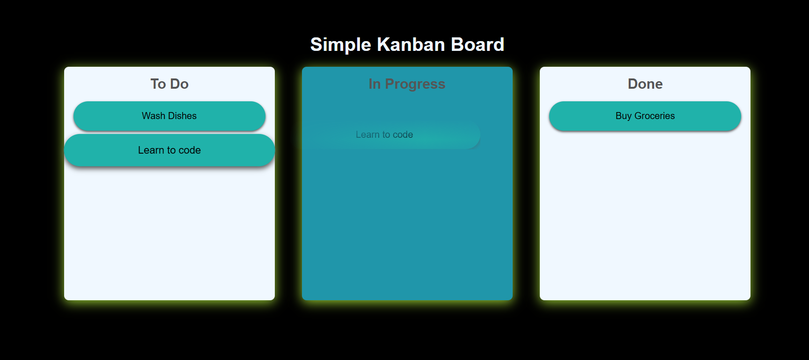
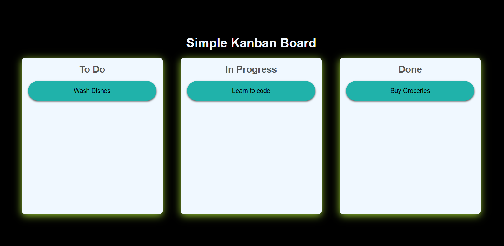

# A Kanban board is a visual project management tool designed to help teams visualize their workflow

## It's a Drag and Drop cards project

## Here is an overview about the full project

#### before we start to drag or drop

#### while the process

#### after we put it in the board we need

