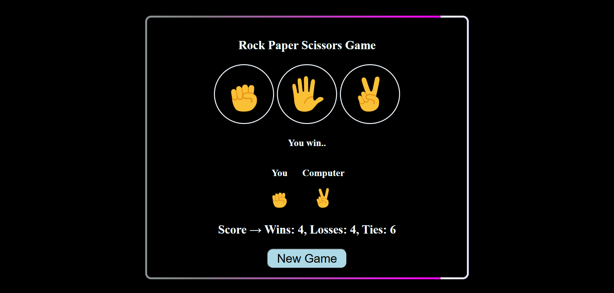

# here's the overview about the project i created --> i used html , css , js in my learning path to learn js .

##here's an overview about the project 
### the project is friendly using and it have some good features with js and css there is also an inimation around the border that move in infinite loop and when hover   on the card will gave you a 3d shape of the card 

